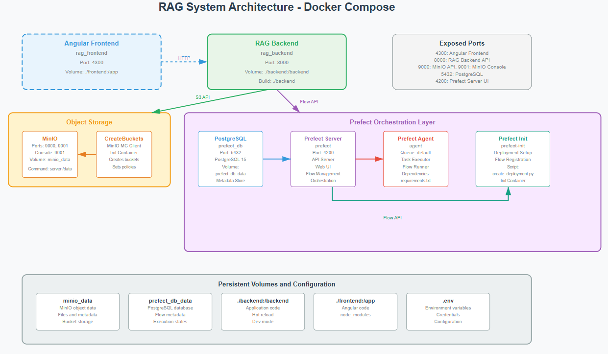

# RAG System with Automated ETL Pipeline

A comprehensive Retrieval-Augmented Generation (RAG) system built with FastAPI, LangChain, and Angular, featuring automated ETL processes orchestrated by Prefect for periodic data ingestion from multiple sources.

## 🏗️ Architecture Overview



This system implements a modern RAG architecture with the following key components:

- **Frontend**: Angular-based user interface for querying the RAG system
- **Backend**: FastAPI application with LangChain integration for RAG functionality
- **Data Storage**: MinIO object storage for document management
- **Orchestration**: Prefect for automated ETL pipeline management
- **Database**: PostgreSQL for Prefect metadata storage

## 🚀 Key Features

- **Automated Data Ingestion**: Periodic ETL processes that fetch documents from multiple sources
- **Object Storage**: MinIO integration for scalable document storage
- **RAG Implementation**: LangChain-powered retrieval-augmented generation
- **Web Interface**: Angular frontend for intuitive user interactions
- **Workflow Orchestration**: Prefect-based scheduling and monitoring of data pipelines
- **Containerized Deployment**: Full Docker Compose setup for easy deployment

## 📋 Prerequisites

- Docker and Docker Compose
- Python 3.9+ (for local development)
- Node.js 16+ and Angular CLI (for frontend development)

## 🛠️ Installation & Setup

### 1. Clone the Repository

```bash
git clone <https://github.com/DarioDeMaio/RAG.git>
cd rag-system
```

### 2. Environment Configuration

Create a `.env` file in the root directory with the following variables:

```env
#OPENAI
OPENAI_API_KEY=...
# MinIO Configuration
MINIO_ROOT_USER=...
MINIO_ROOT_PASSWORD=...
AWS_STORAGE_BUCKET_NAME=resources

# PostgreSQL Configuration
POSTGRES_USER=...
POSTGRES_PASSWORD=...
POSTGRES_DB=...
```

### 3. Start the System

```bash
# Start all services
docker-compose up -d --build

# View logs
docker-compose logs -f
```

## 🔧 Services & Ports

| Service | Port | Description |
|---------|------|-------------|
| RAG Backend | 8000 | FastAPI application with RAG endpoints |
| Angular Frontend | 4300 | Web interface |
| MinIO API | 9000 | Object storage API |
| MinIO Console | 9001 | MinIO web management interface |
| Prefect Server | 4200 | Workflow orchestration UI |
| PostgreSQL | 5432 | Database for Prefect metadata |

## 📊 System Components

### Backend (FastAPI + LangChain)
- **Location**: `./backend/`
- **Technology**: FastAPI, LangChain
- **Features**: 
  - RAG query processing
  - Document embedding and retrieval
  - Integration with MinIO for document storage
  - RESTful API endpoints

### Frontend (Angular)
- **Location**: `./frontend/`
- **Technology**: Angular
- **Features**: 
  - User-friendly query interface
  - Real-time RAG responses
  <!-- - Document management interface -->

### Data Storage (MinIO)
- **Object Storage**: Documents
- **Bucket Management**: Automated bucket creation via init container
- **Access**: S3-compatible API for seamless integration

### Orchestration (Prefect)
- **Workflow Management**: Automated ETL pipeline scheduling
- **Monitoring**: Real-time pipeline status and logging
- **Scalability**: Agent-based task execution
- **Database**: PostgreSQL for metadata persistence

## 🔄 ETL Pipeline

The system implements automated ETL processes that:

1. **Extract**: Periodically fetch documents from configured sources (currently MinIO)
2. **Transform**: Process and clean documents for optimal RAG performance
3. **Load**: Store processed documents and update vector embeddings

### Pipeline Management

Access the Prefect UI at `http://localhost:4200` to:
- Monitor pipeline executions
- Schedule new workflows
- View execution logs and metrics
- Manage deployment configurations

## 🚦 Getting Started

### 1. Access MinIO Console
- URL: `http://localhost:9001`
- Credentials: Use values from `.env` file
- Upload your documents to the configured bucket

### 2. Monitor ETL Processes
- URL: `http://localhost:4200`
- View automated pipeline executions
- Check data ingestion status

### 3. Query the RAG System
- Backend API: `http://localhost:8000`
<!-- - API Documentation: `http://localhost:8000/docs` -->
- Test RAG queries via the FastAPI interface

### 4. Frontend Access
- Frontend: `http://localhost:4300`